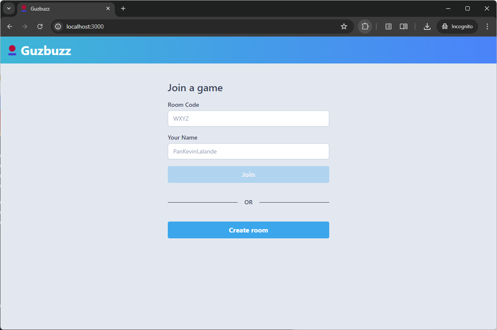
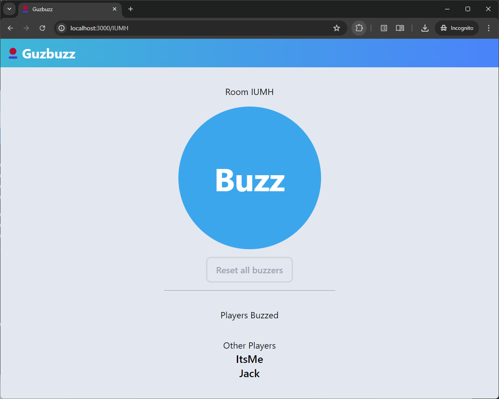
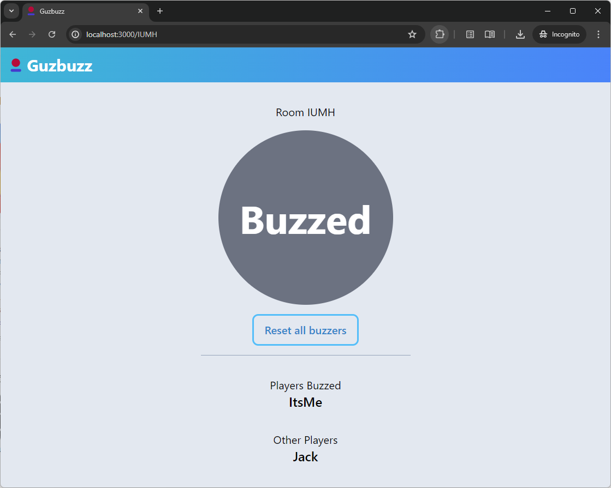

# Guzbuzz
Buzzer app for multiplayer quiz-like games.

It is using WebSockets for communication, Spring Boot + Redis for Backend and React.js + Tailwind CSS for Frontend.
## How to run
```
docker compose build
docker compose up
```
App will be running on http://localhost:3000
## How it looks like



## Future developments and contribution
- TBD